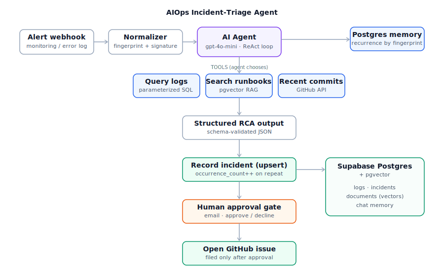

# AIOps Incident-Triage Agent

> An autonomous agent that triages production incidents. When a monitoring alert
> fires a webhook, the agent investigates on its own — queries application logs,
> searches runbooks via RAG, and checks recent git commits — then drafts a
> root-cause hypothesis and, after human approval, opens a GitHub issue. Memory
> tracks recurring incidents.

**Stack:** n8n (native AI Agent node) · OpenAI `gpt-4o-mini` + embeddings ·
Supabase (Postgres + pgvector) · GitHub Actions

**Demonstrates:** AI agents · function/tool calling · retrieval-augmented
generation (RAG) · agent memory · tool chaining · cloud database · tested
custom code · CI/CD · human-in-the-loop safety

---

## What it does

A real on-call engineer, woken by an alert, does roughly this: pull the recent
logs, check whether anything was just deployed, look up the runbook for the
symptom, then write up a likely cause and file a ticket. This project automates
that first-responder loop with an LLM agent — while keeping a human in control
of the one action that writes to an external system.

When an alert hits the webhook, the agent decides for itself which of three
tools to use and in what order:

1. **Query logs** — parameterized SQL against a cloud Postgres `logs` table.
2. **Search runbooks** — semantic search over a pgvector knowledge base of
   runbooks and past-incident writeups (RAG).
3. **Check recent commits** — the GitHub REST API, to correlate the incident
   with a recent deploy.

It then produces a schema-validated root-cause object (title, severity,
hypothesis, evidence, recommended action, confidence), records the incident in a
cloud database (incrementing an occurrence count for repeats), and — only after
a human clicks **Approve** in an email — opens a GitHub issue.

## Why the design choices matter

- **Fingerprint-based recurrence.** Incoming messages are normalized by
  stripping volatile values (numbers, trace ids) into a stable *signature*, so
  "timeout after 30000ms" and "timeout after 12ms" collapse to one fingerprint.
  That fingerprint keys both the agent's memory and an upsert into the
  `incidents` table, turning "this has happened before" into a queryable fact.
- **Parameterized SQL only.** Every database call binds values as parameters
  (`$1`, `$2`, …) — no string concatenation — so the agent can choose *what* to
  look up but cannot inject SQL.
- **Least-privilege tokens.** The investigation tools use a read-only GitHub
  token; only issue creation uses a write-scoped token, and that write is gated.
- **Human-in-the-loop on writes.** The agent reads freely but cannot file an
  issue without explicit human approval, so an over-confident or wrong diagnosis
  can never act on its own.

## Repository layout

| Path | Contents |
|------|----------|
| `workflows/` | Exported n8n workflow JSON (`incident-triage`, `runbook-ingest`) |
| `db/schema.sql` | Supabase schema: pgvector, `logs`, `incidents`, `documents`, `match_documents` |
| `code/` | Extracted, unit-tested normalizer + fingerprint logic |
| `code/tests/` | Tests run by CI (Node built-in test runner) |
| `.github/workflows/ci.yml` | CI: lint, tests, workflow-JSON + schema validation |
| `docs/` | Architecture writeup, demo cheat-sheet, runbooks |

## How it works (technical)

The workflow is built in n8n. The **AI Agent** node (Tools Agent / ReAct) is
wired to an OpenAI chat model, three tools, a Postgres chat-memory sub-node, and
a structured-output parser. A webhook trigger receives the alert; a Code node
normalizes it into the incident object and fingerprint; the agent investigates
and emits structured JSON; a parameterized upsert records the incident; an email
approval node gates the GitHub issue creation; the issue URL is written back to
the incident row.

The RAG knowledge base lives in Supabase using the LangChain-compatible
`documents` table and `match_documents` function (1536-dim OpenAI embeddings).
A separate `runbook-ingest` workflow embeds and loads the runbook docs.

The fingerprint/normalization logic is duplicated as a standalone module in
`code/normalize.js` so it can be unit-tested independently of n8n; CI runs those
tests on every push.

## Setup

1. **Database** — create a Supabase project, run `db/schema.sql` in the SQL
   editor. Use the **Session pooler** connection (port 5432) for n8n.
2. **n8n** — `npm install -g n8n` (Node 20.19–24.x), then `n8n`. Import the
   workflows from `workflows/`.
3. **Credentials** — add OpenAI, Supabase (Postgres + API key), GitHub (token),
   and an email credential in n8n. See `.env.example` for the values to gather.
4. **Ingest runbooks** — run the `runbook-ingest` workflow once.
5. **Trigger a triage** — see `docs/demo.md` for the exact curl commands.

> Secrets live only in n8n's encrypted credential store and a gitignored
> `.env`; nothing sensitive is committed.

## Phase checklist

- [x] Phase 0 — Environment & repo
- [x] Phase 1 — Cloud database & schema
- [x] Phase 2 — Webhook → respond slice
- [x] Phase 3 — Tool calling: query logs
- [x] Phase 4 — RAG: search runbooks
- [x] Phase 5 — Git context tool
- [x] Phase 6 — Structured output
- [x] Phase 7 — Memory & recurrence
- [x] Phase 8 — Open GitHub issue (gated)
- [x] Phase 9 — CI/CD
- [ ] Phase 10 — Polish & extras

## License

MIT
